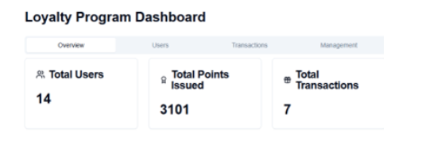
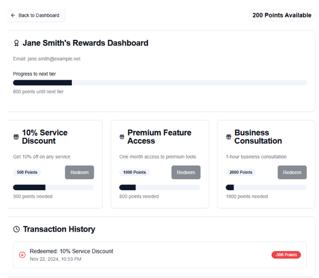
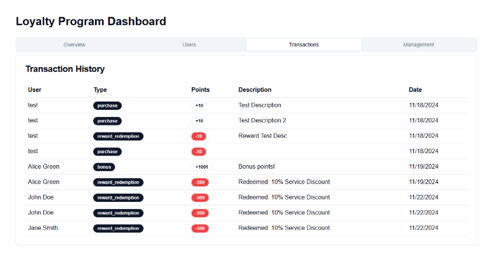
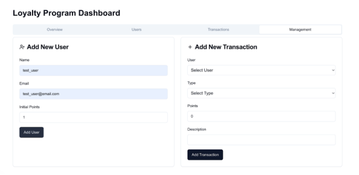
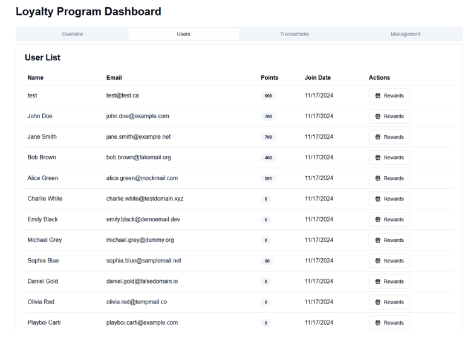

# AlphaBiz Loyalty Program Web Portal (Next.js/React/MongoDB)

---

## 🧾 Project Overview

This project simulates a loyalty program for a mock company, **AlphaBiz**, developed as part of the **CPS714 - Software Engineering** course.

The portal rewards clients for:

- Product purchases  
- Software subscriptions  
- Participation in business development events  

Clients can redeem accumulated points for:

- Discounts on services  
- Premium feature access  
- Exclusive business tools and resources  

The system includes:

- A **client-facing portal** to track and redeem rewards  
- An **admin dashboard** for managing rewards, engagement, and program performance

---

## 🛠️ Sub-Project: Loyalty Points & Rewards System

### 👥 Team: Loyalty & Rewards

### ✨ Key Features

- **Points Accumulation**  
  Clients earn points based on purchases, subscriptions, and event participation.

- **Reward Redemption**  
  Points can be used for discounts, premium tools, and more.

- **Engagement Bonuses**  
  Bonus points awarded for attending webinars or interacting with support.

---

## 🔍 Preview

> 📸 *A look at the UI components of the loyalty program system.*

---

### 🛠️ Admin Dashboard

A central panel for AlphaBiz administrators to manage rewards, view analytics, and oversee client activity.

---

### 👤 User Portal: Main Dashboard

The user dashboard shows loyalty points, quick actions, and upcoming reward opportunities.

---

### 📄 User Portal: Transactions

Clients can track their point-earning activities and redemption history here.

---

### 🎁 User Portal: Reward Management

Browse available rewards, view eligibility, and redeem points.

---

### 👥 User Directory (Admin View)

An overview of registered users, including their loyalty tier and engagement status.

