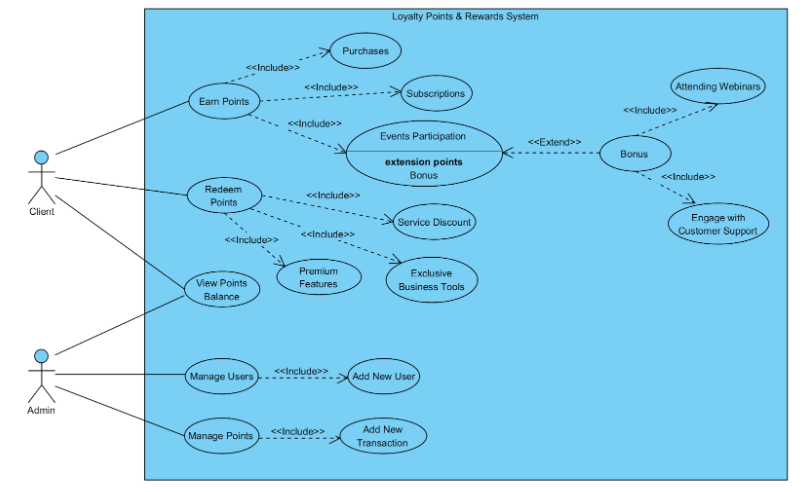
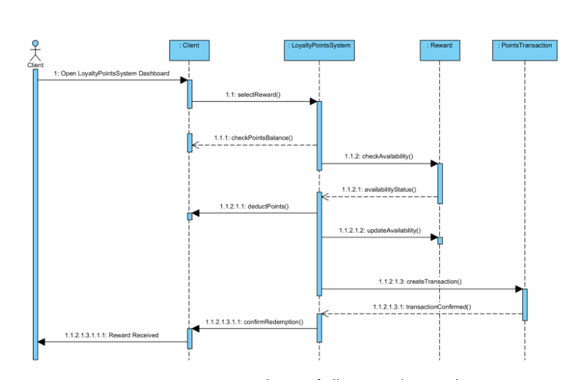

# AlphaBiz Loyalty Program Web Portal (Next.js/React/MongoDB) -  Loyalty Points & Rewards System

---

## 📚 Table of Contents

- [🧾 Project Overview](#-project-overview)
- [🛠️ Sub-Project: Loyalty Points & Rewards System](#️-sub-project-loyalty-points--rewards-system)
- [📊 Diagrams](#-diagrams)
- [🔍 Preview](#-preview)
  - [🛠️ Admin Dashboard](#️-admin-dashboard)
  - [👥 User Directory (Admin View)](#-user-directory-admin-view)
  - [👤 User Portal: Main Dashboard](#-user-portal-main-dashboard)
  - [📄 Transactions](#-transactions)
  - [🎁 Management](#-management)
- [🙌 Acknowledgements](#-acknowledgements)

---

## 🧾 Project Overview

This project simulates a loyalty program for a mock company, **AlphaBiz**.

The portal rewards clients for:

- Product purchases  
- Software subscriptions  
- Participation in business development events  

Clients can redeem accumulated points for:

- Discounts on services  
- Premium feature access  
- Exclusive business tools and resources  

The system includes:

- A **client-facing portal** to track and redeem rewards  
- An **admin dashboard** for managing rewards, engagement, and program performance

---

## 🛠️ Sub-Project: Loyalty Points & Rewards System

### 👥 Team: Loyalty & Rewards

### ✨ Key Features

- **Points Accumulation**  
  Clients earn points based on purchases, subscriptions, and event participation.

- **Reward Redemption**  
  Points can be used for discounts, premium tools, and more.

- **Engagement Bonuses**  
  Bonus points awarded for attending webinars or interacting with support.

---

## 📊 Diagrams

  

<i>Figure 1: UML Class Diagram of Loyalty Points & Rewards System</i>

  

<i>Figure 2: UML Sequence Diagram of Client Reward Transaction</i>

According to Figure 1, the UML Use Case Diagram has a client and a user that are able to use the Loyalty Points & Rewards System. The client is able to earn points, redeem points, and view points balance. Earning points include purchases, subscriptions, and events participation; having the ability to gain bonus points by attending webinars, and engaging with customer support. Redeeming points allows the client to obtain a service discount, gain access to exclusive business tools, and other premium features of BizPoints. 

The administrator can use the Loyalty Points & Rewards System to manage users by adding new users, manage points by adding new transactions, and viewing a client’s points balance.  

---

## 🔍 Preview

---

### 🛠️ Admin Dashboard

A central panel for AlphaBiz administrators to view analytics and oversee client activity.

  

<i>Figure 3: Admin Dashboard</i>

---

### 👥 User Directory (Admin View)

This view displays key information about users, including name, email, points, and join date.  
From here, the admin can access individual user profiles by clicking the **"Rewards"** button.

For demonstration purposes, selecting Jane Smith directs us to her personalized dashboard, shown below.

  

<i>Figure 4: User Directory (Admin View)</i>

---

### 👤 User Portal: Main Dashboard

The user dashboard consolidates core functionality: point accumulation, reward redemption, and engagement bonuses — all in one intuitive view.

  

<i>Figure 5: User Dashboard</i>

---

### 📄 Transactions

Admins can monitor redemption history for all users, including the date and details of each transaction.

  

<i>Figure 6: Transaction History</i>

---

### 🎁 Management

Admins have the ability to manually add new users or log transactions.

  

<i>Figure 7: Admin Management Panel</i>

---

## 🙌 Acknowledgements

Aziz M., Ahmad H., Victor D., Jose J., Marcus U.
